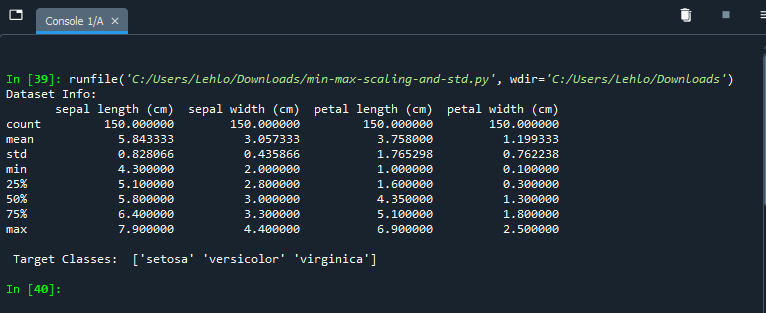
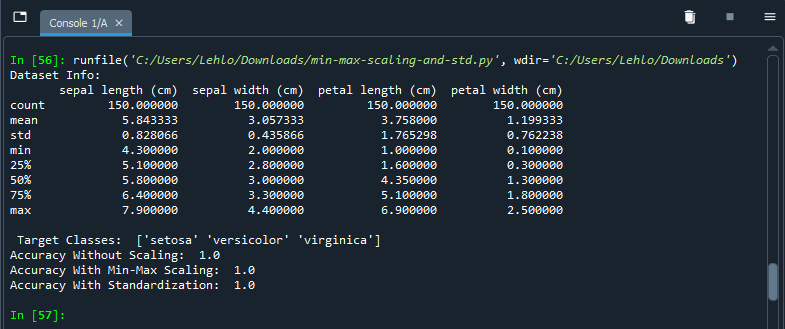

# Project: Min-Max Scaling & Standardization – Impact on k-NN Classifier (Iris Dataset)

## Overview
**Course Section**: Data Scaling and Normalization  
**Goal**:  
- Demonstrate how to apply **MinMaxScaler** (scales features to 0–1 range) and **StandardScaler** (centers to mean=0, std=1) using scikit-learn  
- Train and evaluate a simple **k-Nearest Neighbors (k-NN)** classifier (k=5)  
- Compare model accuracy **before scaling**, **after Min-Max scaling**, and **after standardization**  
- Understand why scaling is especially important for distance-based algorithms like k-NN

## Dataset
- **Iris** (built-in from scikit-learn)  
- 150 samples, 4 numerical features (sepal length/width, petal length/width), 3 balanced classes  
- Features already have similar scales → this dataset is a gentle example where scaling impact is often small, but the process is clearly demonstrated

## What this project covers
- Loading and basic inspection of the dataset  
- Train-test split (80/20, stratified)  
- k-NN training & evaluation on **raw (unscaled)** data  
- Applying **Min-Max Scaling** → retrain & evaluate  
- Applying **Standardization** → retrain & evaluate  
- Side-by-side accuracy comparison  
- Visual comparison of feature distributions before/after scaling (boxplots)

## Files
- `min-max-scaling-and-std.py`     → Standalone runnable script  

## Key Observations
- On the Iris dataset, accuracy is typically very high (~0.9667–1.0000) in all three cases because feature scales are already comparable  
- Scaling usually has **minimal or no negative impact** here, but it becomes critical on real-world datasets where features have very different ranges (e.g., age 0–100 vs annual income 0–1,000,000)  
- **Standardization** is often preferred for algorithms that assume normally distributed data  
- **Min-Max scaling** is useful when features need to be bounded (e.g., for neural networks or when preserving zero values matters)

## Screenshots from Execution

**1. Dataset Summary (X.describe())**  
Shows the original feature ranges (all in roughly 0–8 cm scale).  

**2. Accuracy Comparison Table**  
Side-by-side results for no scaling vs scaled versions.  

## Next Steps / Potential Improvements
- Visualize decision boundaries of k-NN before/after scaling  
- Experiment with different `k` values (loop from 1 to 15)  
- Use k-fold cross-validation instead of a single split  
- Test on a dataset with highly varying feature scales (e.g., add synthetic extreme outliers or use another UCI dataset)  
- Compare scaling impact on other distance-based models (e.g., SVM, KMeans)

**Course Relevance**: Essential preprocessing technique — directly builds on Day 1 data understanding and prepares for feature engineering (Days 3–5), model evaluation, and advanced algorithms.

**Author**: LEHLOHONOLO SAOHATSE
**Date**: 29 January 2026
