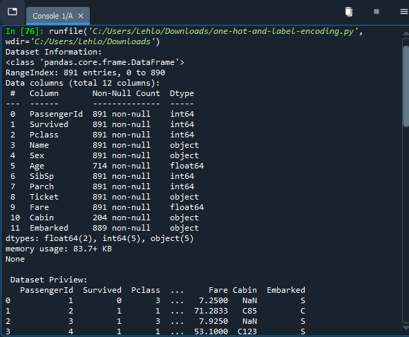
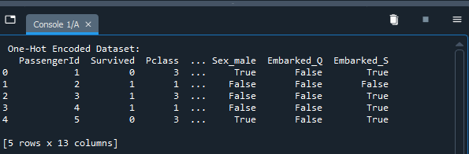
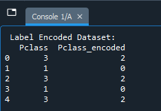
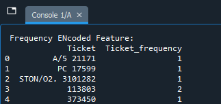

# Project: Categorical Encoding Techniques – Impact on Logistic Regression (Titanic Dataset)

## Overview
**Course Section**: Day 3 – Encoding Categorical Variables  
**Goal**:  
- Apply different encoding methods to categorical features in the Titanic dataset  
- Compare **One-Hot Encoding** (for nominal variables like `Sex` and `Embarked`)  
- Demonstrate **Label Encoding** (ordinal-like, e.g., on `Pclass`)  
- Show **Frequency Encoding** (for high-cardinality features like `Ticket`)  
- Train a simple **Logistic Regression** model using the one-hot encoded data  
- Observe how proper encoding enables modeling and affects performance

## Dataset
- **Titanic** (loaded from repo: `data/titanic.csv`)  
- ~891 rows (train set)  
- Target: `Survived` (binary: 0 = No, 1 = Yes)  
- Key categorical columns used: `Sex`, `Embarked`, `Pclass`, `Ticket`  
- Dropped high-cardinality / irrelevant: `Name`, `Ticket` (original), `Cabin`, `Age` (for simplicity – no imputation yet)

## What this notebook/script covers
- Load & inspect data (`info()`, `head()`)  
- **One-Hot Encoding** on `Sex` and `Embarked` (with `drop_first=True` to avoid multicollinearity)  
- **Label Encoding** on `Pclass` (treats it as ordinal)  
- **Frequency Encoding** on `Ticket` (maps to count of occurrences – useful for high-cardinality)  
- Prepare feature matrix `X` (one-hot version) + target `y`  
- Train-test split (80/20, random_state=42)  
- Fit **Logistic Regression** (max_iter=200 for convergence)  
- Evaluate with accuracy score

## Files
- `one-hot-and-label-encoding.py`     → Your original script 

## Key Observations
- **One-Hot Encoding** is ideal for nominal categories (`Sex`, `Embarked`) → creates binary columns (`Sex_male`, `Embarked_Q`, `Embarked_S`)  
- **Label Encoding** suits ordinal features (`Pclass`: 1 > 2 > 3) but can imply unwanted order if misused  
- **Frequency Encoding** helps with high-cardinality features like `Ticket` (many unique values) by turning them into numeric counts  
- Dropping `Age` (missing values) and not handling other missing data keeps it simple — real projects would impute first  
- Logistic Regression on one-hot encoded data typically achieves **~0.78–0.82 accuracy** on Titanic test split (baseline without feature engineering)  
  → Sex and Pclass are strong predictors; adding more features/imputation boosts this higher

## Screenshots to Add (run the notebook/script and capture)
- Dataset info & head (before encoding)  
  

- One-hot encoded head (shows dummy columns)  
  

- Label encoded Pclass example  
  

- Frequency encoded Ticket example  
  

- Final accuracy result  
  

(Add these to an `images/` subfolder after running)

**Course Relevance**: Directly from Day 3 — shows why encoding is essential before feeding data to ML models. Builds toward full pipelines (feature engineering + modeling).
