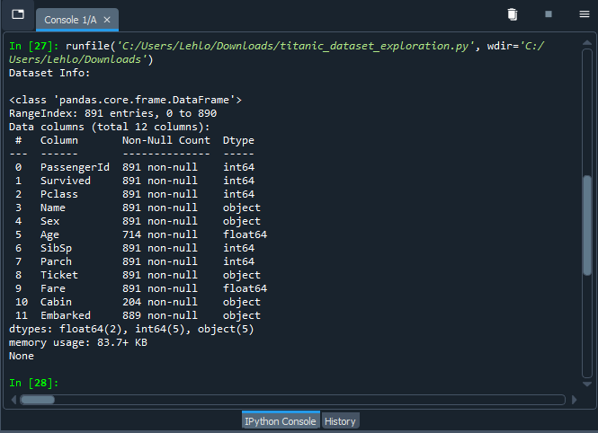
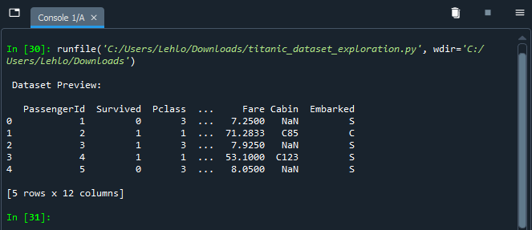
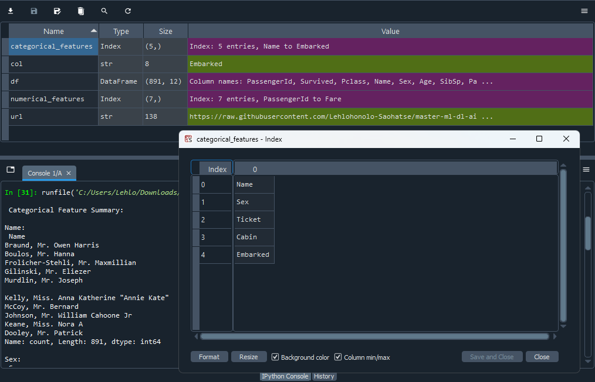
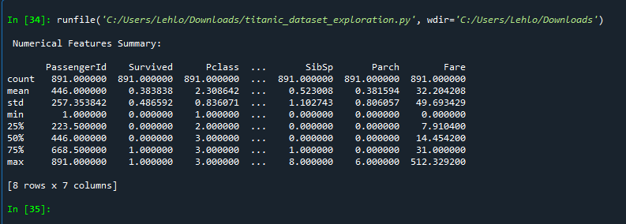

# Project: Titanic - Initial EDA
## Overview
First hands-on task in the **AI Engineer Associate Certificate Course**.  
Focus: Load data, inspect structure, identify feature types (categorical vs numerical), and summarize distributions - foundational steps before any feature engineering or modeling.

## Dataset
- **Source**: Classic Titanic dataset (passenger survival prediction)
- **Rows**: ~891 (training set)
- **File**: [`../../data/titanic.csv`](../data/titanic.csv) (loaded via raw GitHub URL)
- **Target**: `Survived` (0 = No, 1 = Yes)

## Columns & Meaning
| Column      | Type       | Description                                                                 |
|-------------|------------|-----------------------------------------------------------------------------|
| PassengerId | int        | Unique ID for each passenger                                                |
| Survived    | int        | Survival (0 = died, 1 = survived) — **target variable**                     |
| Pclass      | int        | Ticket class (1 = 1st, 2 = 2nd, 3 = 3rd) — proxy for socio-economic status  |
| Name        | object     | Passenger's full name                                                       |
| Sex         | object     | Gender (male / female)                                                      |
| Age         | float      | Age in years (fractional if <1)                                             |
| SibSp       | int        | # of siblings / spouses aboard                                              |
| Parch       | int        | # of parents / children aboard                                              |
| Ticket      | object     | Ticket number                                                               |
| Fare        | float      | Passenger fare                                                              |
| Cabin       | object     | Cabin number (many missing)                                                 |
| Embarked    | object     | Port of embarkation (C = Cherbourg, Q = Queenstown, S = Southampton)       |

## What this notebook covers
- Data loading from GitHub raw URL
- Basic info (`df.info()`): types, non-null counts → reveals missing values in Age, Cabin, Embarked
- Preview (`df.head()`)
- Feature separation: categorical vs numerical
- Value counts for categorical features (distribution & cardinality)
- Statistical summary for numerical features (mean, std, min/max, quartiles)

## Key Observations (add your own after running!)
- High missing values in **Cabin** (~77%) → may drop or engineer later
- **Age** has some missing values → imputation needed
- **Sex** and **Pclass** likely strong predictors of survival
- **Name** and **Ticket** high cardinality → feature engineering potential (titles, family size, etc.)

## Screenshots
(Add your screenshots here after running the notebook)

- Dataset Info & Preview  
    
  

- Categorical Summaries  
  

- Numerical Summary  
  

## Next Steps (to be added in future notebooks)
- Handle missing values
- Feature engineering (e.g., Title from Name, FamilySize = SibSp + Parch + 1)
- Encoding categoricals
- Basic visualizations (histograms, boxplots, survival rate by group)
- First simple model (e.g., logistic regression)

**Course Relevance**: Prepares data understanding for feature engineering (Days 1–5) and model evaluation.
